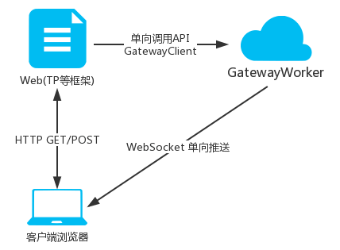

# Panda消息扩展



`使用workerman进一步封装，单向推送给客户端，服务端代码可自由发挥实现,该扩展只实现单向通知客户端`

## 使用方式

1. `composer require panda-zhy/msg`
2. `php think panda:create 该命令操作会自动创建workerman启动文件以及生成gateway进程启动脚本、businessWorker进程启动脚本、注册服务启动脚本`

# 消息类型
> `用不用都行随自己，可以自己定义类型,参数格式不可边其他随意`
```json
{
  "type": "ping",
  "data": [],
  "msg": "心跳检测",
  "time": 1695029183
}
```

| 类型         | 译文   | 详细参数                                                                                    | 参数说明                |
|------------|------|-----------------------------------------------------------------------------------------|---------------------|
| ping       | 心跳检测 | 无                                                                                       | 无                   |
| system     | 系统通知 | [自定义二级消息类型]  例如:["type":"system_friend_apply","data":["自定义参数":"自定义参数"],"msg":"xxx申请加你好友"] | 例如: 站内通知、订单通知、好友通知等 |
| chat       | 聊天通知 | [自定义二级消息类型]  例如:["type":"image","data":["自定义参数":"自定义参数"],"msg":"xxx发来一张图片"]             | 聊天框内的通知             |
| chatPrompt | 聊天提示 | [自定义二级消息类型]  例如:["type":"reservation","data":["自定义参数":"自定义参数"],"msg":"xxx向你发起了预约"]      | 聊天框内的提示             |

